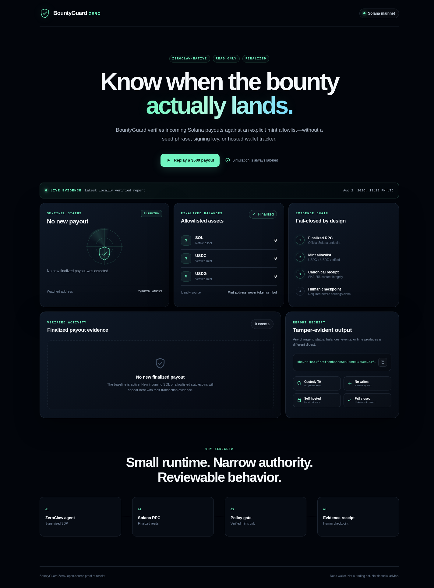
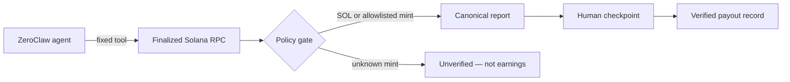

# BountyGuard Zero

**A self-hosted, read-only Solana payout sentinel for bounty earners, powered by ZeroClaw.**

BountyGuard answers one narrow question: **did a real bounty payment arrive?** It
verifies finalized incoming SOL, USDC, and USDG against explicit mint addresses,
then emits a canonical SHA-256 receipt—without ever loading a seed phrase or
signing key.



**Live operator console:** https://waroxa.github.io/bountyguard-zero/

**Two-minute demo:** [`docs/bountyguard-zero-demo.mp4`](docs/bountyguard-zero-demo.mp4)

The first authenticated ZeroClaw execution is preserved as a redacted,
reproducible receipt in [`docs/AUTHENTICATED-RUN.md`](docs/AUTHENTICATED-RUN.md).

## Why this belongs inside ZeroClaw

The scanner is useful on its own; ZeroClaw turns it into a supervised operating
procedure. An agent can run the fixed read-only tool, explain the evidence,
pause at a human checkpoint, and only then record a payout as verified. The
runtime profile grants no transaction-writing capability.



## Features

- **Custody T0:** no seed phrase, private key, signing method, transaction
  builder, or wallet adapter exists anywhere in the project.
- **Finality first:** transaction and balance reads use `finalized` commitment.
- **Mint-aware:** a token counts only when its mint and decimals match the local
  allowlist. Lookalike symbols remain unverified.
- **Prompt-injection resistant:** memos, token metadata, logos, and other
  on-chain strings never enter the agent context.
- **Tamper-evident:** every report receives a canonical SHA-256 content digest.
- **Fail-closed:** RPC, parsing, configuration, and schema errors are reported as
  verification failures—not as “no payment.”
- **ZeroClaw-native:** local skill bundle, constrained runtime profile,
  supervised SOP, tool receipts, and human confirmation gate are included.
- **Operator console:** responsive live-evidence view plus an unmistakably
  labeled simulated replay for demonstration.

## Repository map

```text
bundle/bountyguard/
  SKILL.toml                         fixed-command ZeroClaw tool
  SKILL.md                           agent operating contract
  scripts/bountyguard.py             standard-library Solana scanner
config/bountyguard.example.json      safe public configuration template
console/                             static operator console
design-system/bountyguard-zero/      visual source of truth
docs/                                verified screenshots
sops/payout-watch/                   supervised ZeroClaw SOP
tests/                               offline security and behavior tests
```

## Reproduce in five minutes

Requirements: Python 3.11+ and a stock ZeroClaw v0.8.4 binary.

```sh
git clone https://github.com/waroxa/bountyguard-zero.git
cd bountyguard-zero

python3 -m unittest discover -s tests -v
zeroclaw skills audit bundle/bountyguard
zeroclaw sop validate sops/payout-watch/SOP.md
```

Run a safe public baseline scan against the Solana System Program address:

```sh
python3 bundle/bountyguard/scripts/bountyguard.py \
  --config config/bountyguard.example.json \
  --state /tmp/bountyguard-state.json \
  --report /tmp/bountyguard-report.json \
  --format text
```

Serve the static operator console:

```sh
python3 -m http.server 4173 --directory console
```

Then open `http://127.0.0.1:4173`. The **Replay a $500 payout** control is a
clearly labeled simulation and never presents its fixture as on-chain evidence.

## Install the ZeroClaw skill

```sh
zeroclaw skills audit bundle/bountyguard
zeroclaw skills install bundle/bountyguard --bundle bountyguard
```

Copy `config/bountyguard.example.json` to the ZeroClaw agent workspace as
`bountyguard.local.json`, copy `bundle/bountyguard/scripts/bountyguard.py` to
that workspace root, set a public payout address, and keep the local config out
of source control. The installed tool is
`bountyguard__scan_finalized_payouts`.

For a real run, ask the configured agent to execute the `payout-watch` SOP. The
included checkpoint makes an earnings claim a human decision, not an automatic
side effect of model output.

## Evidence model

A verified event contains:

1. a finalized Solana transaction signature;
2. the positive owner balance delta;
3. either native SOL or an allowlisted mint/decimal pair;
4. a Solana explorer URL; and
5. a canonical report receipt.

The initial run creates a baseline and does **not** claim historical activity as
a new payout. Unknown tokens may be surfaced for attention, but they never
count as earnings.

## Threat model

| Threat | Control | Residual risk |
|---|---|---|
| Seed or signing-key theft | No custody code or signing tools | Operator must still protect the unrelated wallet elsewhere |
| Fake stablecoin symbol | Mint + decimals allowlist | Allowlist maintainer can configure a wrong mint |
| Untrusted memo/metadata injection | Those fields are never fetched | RPC transaction structure remains untrusted and strictly parsed |
| RPC outage or malformed response | Fail closed with `verification_failed` | Availability depends on the configured endpoint |
| Report modification | Canonical SHA-256 receipt | Digest proves integrity, not third-party attestation |
| Agent overclaim | Supervised SOP + human checkpoint | Human reviewer must inspect the returned evidence |

The RPC endpoint itself is constrained to an explicit HTTPS hostname allowlist.
This proof of concept supports the official Solana mainnet endpoint only.

## Safety boundary

BountyGuard can observe a public address. It cannot prove who controls it, move
funds, trade, swap, bridge, approve, refund, or sign anything. It is operational
monitoring software—not a wallet, trading bot, or financial-advice product.

## License

MIT
